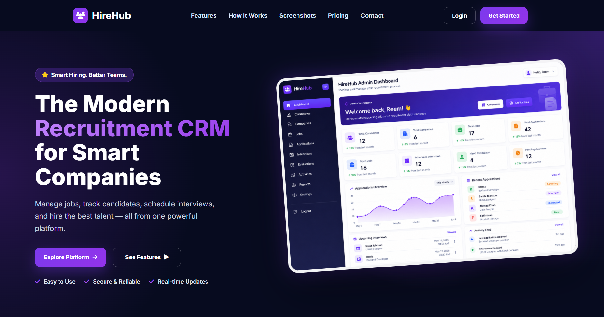
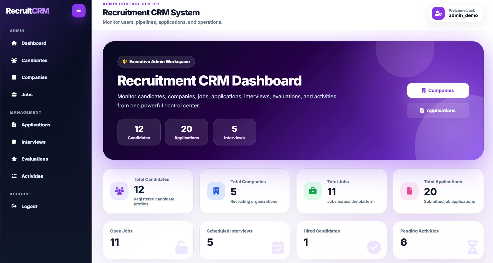
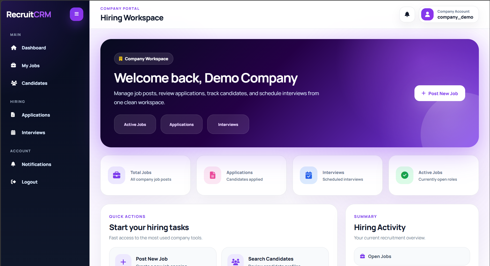
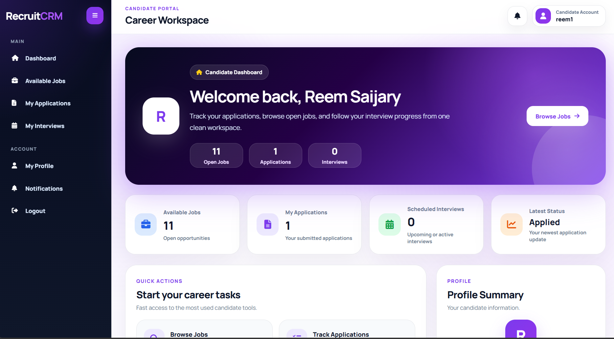
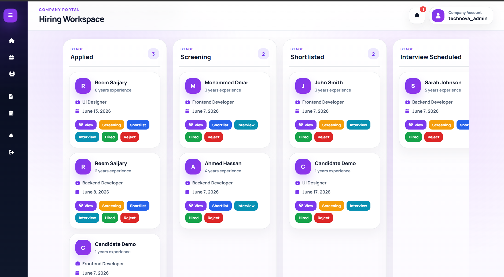

<div align="center">

# 🚀 RecruitCRM

### Modern Recruitment Management System

A full-stack Recruitment CRM built with Django that streamlines candidate management, job posting, application tracking, interview scheduling, and hiring workflows.


### 🌐 Live Demo

https://recruitment-crm-u8jf.onrender.com

</div>

---

# 📖 Overview

RecruitCRM is a role-based Recruitment Management System designed to simplify and automate the hiring process.

The platform provides dedicated dashboards for Administrators, Companies, and Candidates, enabling efficient recruitment workflows from job posting to final hiring decisions.

The system centralizes candidate tracking, interview management, application evaluation, and communication within a modern responsive interface.

---

# ✨ Key Features

## 🔐 Authentication & Security

- Role-Based Access Control
- Google OAuth Login
- Secure Authentication
- Protected Routes
- User Profile Management

---

## 👨‍💼 Admin Dashboard

- Manage Companies
- Manage Candidates
- Manage Jobs
- Manage Applications
- Manage Interviews
- Manage Evaluations
- Manage Activities
- System Statistics Dashboard
- Full CRUD Operations

---

## 🏢 Company Dashboard

- Create Jobs
- Edit Jobs
- Delete Jobs
- View Applications
- Manage Candidates
- Schedule Interviews
- Update Hiring Status
- Kanban Recruitment Pipeline
- Dashboard Analytics

---

## 👤 Candidate Dashboard

- Browse Jobs
- Search Jobs
- Apply to Positions
- Track Application Status
- Upload CV
- Manage Profile
- View Interviews
- Receive Notifications

---

## 🔔 Notification System

Automatic notifications for:

- New Applications
- Interview Scheduling
- Application Status Updates
- Recruitment Activities

---

## 📱 Responsive Design

- Mobile Friendly
- Tablet Friendly
- Desktop Optimized
- Modern UI Design
- Consistent Dashboard Experience

---

# 🖼️ Screenshots

## Landing Page



## Admin Dashboard



## Company Dashboard



## Candidate Dashboard



## Kanban Board



---

# 👥 User Roles

| Role | Permissions |
|--------|------------|
| Admin | Full System Management |
| Company | Job & Recruitment Management |
| Candidate | Job Applications & Profile Management |

---

# 🔄 Recruitment Workflow

```text
New Applicant
      ↓
Screening
      ↓
Shortlisted
      ↓
Interview Scheduled
      ↓
Interview Completed
      ↓
Evaluation
      ↓
Offer Sent
      ↓
Hired / Rejected
```

---

# 🏗️ System Architecture

```text
User
│
├── Admin
├── Company
└── Candidate

Company
│
└── Jobs
      │
      └── Applications
              │
              ├── Interviews
              ├── Evaluations
              ├── Activities
              └── Notifications
```

---

# 🛠️ Tech Stack

## Backend

- Python
- Django 5.x
- SQLite
- PostgreSQL (Supabase)

## Frontend

- HTML5
- CSS3
- JavaScript
- Bootstrap
- Font Awesome

## Authentication

- Django Authentication
- Django Allauth
- Google OAuth

## Deployment

- Render
- Supabase

---

# 🗄️ Database Entities

### Core Models

- User
- Profile
- Company
- Candidate
- Skill
- CandidateSkill
- JobSkill
- Job
- Application
- Interview
- Evaluation
- Activity
- Notification

---

# 📂 Project Structure

```text
Recruitment-CRM/
│
├── backend/
│   ├── core/
│   │   ├── migrations/
│   │   ├── management/
│   │   ├── static/
│   │   ├── templates/
│   │   ├── views/
│   │   ├── models.py
│   │   ├── forms.py
│   │   └── urls.py
│   │
│   ├── crm_backend/
│   │   ├── settings.py
│   │   ├── urls.py
│   │   └── wsgi.py
│   │
│   ├── media/
│   ├── requirements.txt
│   └── manage.py
│
├── docs/
│   └── screenshots/
│
└── README.md
```

---

# ⚙️ Installation

## 1️⃣ Clone Repository

```bash
git clone https://github.com/reemsaijary/Recruitment-CRM.git
```

## 2️⃣ Navigate to Project

```bash
cd Recruitment-CRM/backend
```

## 3️⃣ Create Virtual Environment

```bash
python -m venv venv
```

## 4️⃣ Activate Environment

### Windows

```bash
venv\Scripts\activate
```

### Linux / Mac

```bash
source venv/bin/activate
```

## 5️⃣ Install Dependencies

```bash
pip install -r requirements.txt
```

## 6️⃣ Apply Migrations

```bash
python manage.py migrate
```

## 7️⃣ Run Server

```bash
python manage.py runserver
```

Visit:

```text
http://127.0.0.1:8000
```

---

# 🔑 Environment Variables

Create a `.env` file:

```env
SECRET_KEY=your_secret_key

DEBUG=True

GOOGLE_CLIENT_ID=your_google_client_id

GOOGLE_CLIENT_SECRET=your_google_client_secret

DATABASE_URL=your_database_url
```

---

# ☁️ Deployment

### Hosting

- Render

### Database

- Supabase PostgreSQL


### Authentication

- Google OAuth

---

# 🚀 Future Improvements

- Resume Parsing
- Email Automation
- AI Candidate Matching
- Interview Calendar
- Advanced Analytics
- Export Reports
- Candidate Recommendations

---

# 👩‍💻 Author

### Reem Saijary

Computer Science Student

🔗 GitHub: https://github.com/reemsaijary

🔗 LinkedIn: https://www.linkedin.com/in/reem-saijary-442b2b260/

---

# 📄 License

This project is intended for educational, internship, and portfolio purposes.

---
